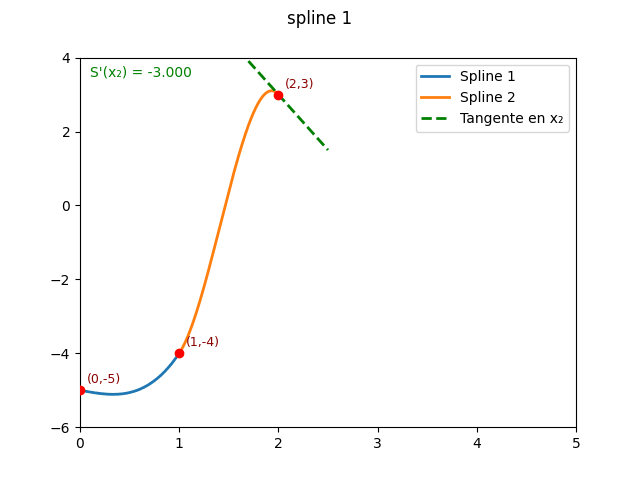

# Taller: Interpolación por Splines Cúbicos en Python


Este taller explora la implementación de **splines cúbicos** en Python usando SymPy, incluyendo la versión clamped (condicionada en derivadas). El objetivo es que los participantes comprendan el método y puedan experimentar con diferentes datos en un entorno interactivo.

---

## Contenido

- Implementación de splines cúbicos condicionados (clamped)
- Ejemplos de uso y visualización simbólica de los polinomios
- Ejercicios para experimentar con distintos conjuntos de datos


---

## Requisitos

- Python 3.8 o superior
- sympy

Instala la dependencia con:

```sh
pip install sympy
```

---

## Uso

Ejemplo básico de uso de la función principal:

```python
import sympy as sym

xs = [0, 1, 2]
ys = [1, 5, 3]
B0 = 2.0  # Derivada en el extremo izquierdo
B1 = -1.0 # Derivada en el extremo derecho

splines = cubic_spline_clamped(xs, ys, B0, B1)
for s in splines:
    display(s)
```

Puedes modificar los valores de `xs`, `ys`, `B0` y `B1` para experimentar.

---

## Créditos

Taller elaborado por [Harry Guajan, Matthe Cedeno, Michael Yanez].  
Para dudas o sugerencias, contacta al instructor.